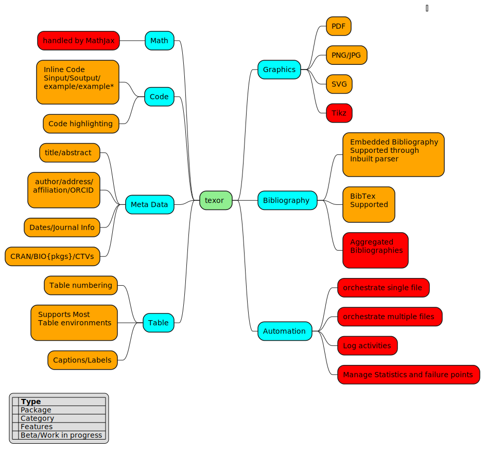

<!-- README.md is generated from README.Rmd. Please edit that file -->

```{r setup, include = FALSE}
knitr::opts_chunk$set(
  collapse = TRUE,
  comment = "#>",
  fig.path = "man/figures/",
  out.width = "100%"
)
```

# texor : Tools for converting LaTeX source files into RJ-web-articles

<!-- badges: start -->


<!-- badges: end -->

texor is a package that deals with multiple challenges that occour in conversion of LaTeX source files (which typically generate a PDF) to a web friendly RJ-web-article format. 

### Currently texor can handle R-Journal structured LaTeX files with support for:

1. RJournal based LaTeX files with macros such as `\pkg{}`,`\CRANpkg{}`,`\BIOpkg{}`, `\code{}`, `\acronym{}`
2. Reading Metadata from LaTeX file as well as DESCRIPTION.
3. Reading bibliography from bibtex files and ignoring `\thebibliography`
4. Supports code environments like `Sinput`,`Soutput`, `example` ,`example*`,`verbatim` with code highlight.
5. Supports graphics included as PDF,PNG,JPG.
6. Functions to convert PDF graphics to PNG.
7. Almost all tables are supported with a few exceptions.
8. Other things like citations,links,footnotes,math are also supported.
9. A parser to read and minimally convert inbuilt `\thebibliography` to bibtex
10. Figure/Table numbering
11. New GNU-sed like find and replace function in R to manage alien commands/environments.

### Work in Progress Features

1. Tikz graphics compilation support functions
2. Better Documentation as vignettes, man pages, articles, web-resource
3. Bibliography aggregation.(moved to [rebib](https://github.com/Abhi-1U/rebib))
4. Automated orchestration function to make the process one seamless process.
5. Logging activities and generating analytics.



## Installation


install the development version from GitHub with:

``` r
# install.packages("remotes")
remotes::install_github("Abhi-1U/texor")
# install.packages("pak")
pak::pak("Abhi-1U/texor")
# also install rebib for bibliography
remotes::install_github("Abhi-1U/rebib")
```

## General Usage
 here is a quick example to use texor package with a sample RJournal article
(included with the package [inst/article](https://github.com/Abhi-1U/texor/tree/master/inst/examples/article))

``` r
# similarly any file path
wd <-  system.file("examples/article", package = "texor")
# first include the style file
texor::include_style_file(wd)
# handle bibliography
rebib::handle_bibliography(wd)
# patch table env using stream editor
texor::patch_table_env(wd)
# patch code env using stream editor
texor::patch_code_env(wd)
# check for tikz if TRUE call tikz related functions(still under work)
texor::article_has_tikz(wd)
# convert pdf to png
texor::pdf_to_png(wd)
# copy files to a /web folder
texor::copy_other_files(wd)
# convert to markdown
texor::convert_to_markdown(wd)
# the below function wont work on any article as it needs a folder structure
# similar to RJournal style /YYYY-ZZ/YYYY-MMM where YYYY is the year, 
# ZZ is the Journal issue number and MMM is the DOI referral(unique article number)
texor::generate_rmd(wd)
texor::produce_html(wd)
```
